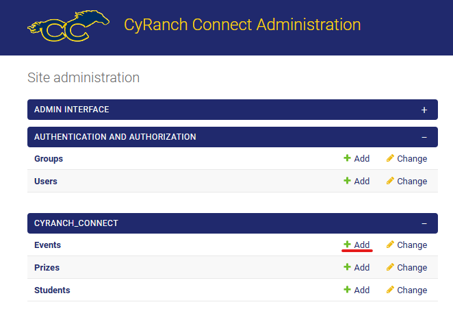

# CyRanch Connect

CyRanch Connect is a tool to help improve student involvement at Cypress Ranch High School.

## Features

- Stunning UI
- Interactive Q & A
- Security Features (CSRF Token Authentication, Password Hashing, XSS protection, etc.)
- Account System
- Student Leaderboards
- Event Calendar
- Point System
- Dynamic QR Codes
- Fully Functional Admin Panel

## Deployment

Begin by cloning the repository to your local machine. Then, run the following commands:

### Installing the dependencies

(PIP)

```shell
python -m pip install
```

(Poetry)

```shell
poetry install
```

### Changing the secret key

Change the secret key in the `settings.py` file to a random string of characters.<br>
We recommended that you store this key in an environment variable for enhanced security.

```python
SECRET_KEY = "<Your Secret Key>"
```

### Run the server

```shell
python manage.py runserver <host>:<port>
```

Example:

```shell
python manage.py runserver 0.0.0.0:8000
```

#### Note: Make sure your firewall is configured to let through port traffic!

## Admin Panel

### Creating an admin account

```shell
python manage.py createsuperuser
```

### Accessing the admin panel

1. Visit `http://<host>:<port>/admin` to access the admin panel.
2. Login with the credentials you created in the previous step.

### Adding events

Events can be created through the admin panel GUI



### Adding points

Points can be added by students scanning the QR code for a given event or through the admin panel GUI by increasing
the `points` field of a student object.

## Advanced Features

### Creating Dynamic QR codes

An admin user who is logged in can create a dynamic QR code for any event by visiting the following URL:
```http://<host>:<port>/event-qr/<event ID>```

#### Note: By using dynamic QR codes, we ensure that students cannot share links with other students to gain points without attending events as each link is only valid for a short period of time

### Creating database backups

```shell
python manage.py dbbackup
```

### Restoring database backups

```shell
python manage.py dbrestore
```

#### Note: If you are restoring a database containing relations you may need to run the above command twice.

#### Note: This will overwrite the current database with the backup.

## File Structure

| **File**                                  | Purpose                                                                            |
|-------------------------------------------|------------------------------------------------------------------------------------|
| `CyRanch_Connect/views.py`                | The main router for the CyRanch Connect web application                            |
| `CyRanch_Connect/models.py`               | Stores the database models used in CyRanch Connect                                 |
| `CyRanch_Connect/templates/`              | The frontend for CyRanch Connect                                                   |
| `CyRanch_Connect/static/`                 | Static files for the frontend to be served by the server                           |
| `templates/base.html`                     | Base template which is extended by all other templates                             |
| `FBLA_CodingProgramming_2023/settings.py` | Manages all settings for CyRanch Connect                                           |
| `manage.py`                               | Control over server functions (Including starting the server and database backups) |

## Tech Stack

- Bootstrap, HTML, CSS, JavaScript
- Jinja2 Templating Engine
- DJango Web Framework
- SQLite3 Database
- Python

## Contact

[siddharth.radh@gmail.com](mailto:siddharth.radh@gmail.com)
[sharvay.srivastava@outlook.com](mailto:sharvay.srivastava@outlook.com)
