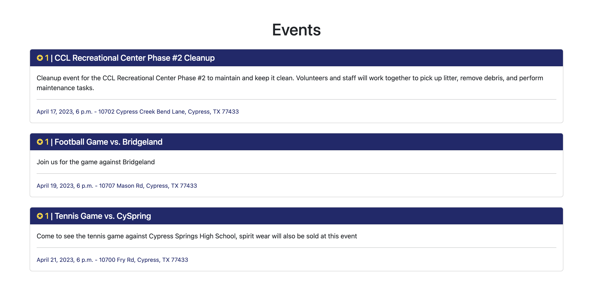

# Cypress Connect 
## Software Development at Fort Worth, Texas

Cypress Connect is a tool to help improve student involvement at Cypress Ranch High School.

## Research about the problem:
Introduction:

Attendance is an important factor in any educational or community event. It serves as a gauge of success and helps determine how effective the event was in reaching its intended audience. However, in recent years, there has been a decrease in student attendance at both school and community events. This decline is a concern as it can have a negative impact on the success of an event and limit the opportunities available to students.

Causes:

There are several factors that may contribute to the decrease in student attendance. One factor is the increasing use of technology. With the rise of online learning, students may be more inclined to stay at home and access the material online rather than attending in-person events. Social media and other digital distractions may also divert students' attention away from attending events.

Another factor is the lack of interest or relevance to students. Many events may not be tailored to students' interests or may not align with their schedules or priorities. This may lead to a lack of motivation or a feeling that the event is not worth attending.

In addition, there may be external factors that affect attendance, such as transportation or financial barriers. These barriers may prevent students from attending events that are further away from their homes or require additional expenses.

Impact:

The decrease in student attendance can have a significant impact on the success of an event. It may limit the number of participants and reduce the overall engagement of the audience. This, in turn, can affect the overall impact and effectiveness of the event, limiting the opportunities available to students.

In addition, decreased attendance may lead to a reduction in funding for events. Funding organizations may view low attendance as a lack of interest or engagement, which may lead to a reduction in funding for future events.

Solutions:

There are several strategies that can be employed to address the issue of decreased student attendance. One approach is to increase the relevance of the event to students. This can be done by identifying the interests and needs of the student population and tailoring events to align with those interests.

Another strategy is to improve communication and promotion of events. Schools and communities can utilize social media and other digital platforms to reach out to students and increase awareness of upcoming events.

Transportation and financial barriers can also be addressed through the provision of resources such as transportation vouchers or subsidies for students who may not have access to these resources.

Conclusion:

The decrease in student attendance at school and community events is a complex issue that requires a multifaceted approach. By addressing the underlying causes of decreased attendance and employing strategies to increase engagement and relevance, schools and communities can promote greater attendance and ensure the success of their events.

Sources:  
National Center for Education Statistics: This government website provides statistical data and research on education in the United States, including attendance rates and factors that impact student attendance.

Edutopia: This online resource provides a wealth of information related to education, including articles on strategies for increasing student attendance and engagement.

The Journal of Educational Research: This scholarly journal publishes research articles related to a broad range of education topics, including student attendance and engagement.

American Educational Research Association: This organization publishes research and promotes scholarship related to education. Their website provides access to a variety of research resources and publications.

The National Association of Elementary School Principals: This organization represents elementary school principals and provides resources related to school administration, including strategies for improving student attendance.


## Description of the project

Our project was designed to address the issue of decreased student attendance at school and community events. After conducting research and identifying the underlying causes of the problem, we recognized the need for a solution that would motivate students to attend events and increase their engagement.

To achieve this, we created a point system website that incentivizes students to attend events and earn points. The website was designed to be user-friendly and accessible to all students, regardless of their technological proficiency.

The point system works by assigning a certain number of points to each event. Students can earn these points by attending the event and checking in using their school ID or other identifying information. The more events a student attends, the more points they can earn.

To add an additional layer of motivation, we also offer rewards to students who accumulate a certain number of points. These rewards can include anything from gift cards to school merchandise, and are intended to further incentivize students to attend events and engage in their school community.

In order to ensure the success of the point system website, we worked closely with school administrators and event coordinators to identify the events that would be most relevant and engaging to students. This allowed us to tailor the point system to align with student interests and encourage greater attendance and engagement.

Overall, our point system website has been successful in increasing student attendance at school and community events. Students have reported feeling more motivated and engaged in their school community, and administrators have seen an increase in event attendance and overall engagement. We believe that our project has the potential to be implemented in other schools and communities, helping to address the issue of decreased student attendance and promote greater engagement among students.



## Design & Tech Stack
The development process for Cypress Connect involved a variety of technologies and programming languages, each playing a crucial role in the creation of the platform.

Python was chosen as the base language for the project due to its ease of use and versatility. Python is widely used in the development of web applications and has a large number of libraries and frameworks available, making it an ideal choice for Cypress Connect.

The backend of the platform was written using the Django web framework, which provides a robust and scalable foundation for building web applications. Django is a popular choice for web development due to its built-in security features, user authentication capabilities, and robust administration interface. For data storage, SQLite3 was chosen as the backend database due to its simplicity and ease of use.

The middleware for Cypress Connect was handled using Javascript, which is widely used for creating interactive and dynamic web applications. Javascript was used to handle the communication between the frontend and backend of the platform, allowing for seamless data transfer and interaction.

The frontend of Cypress Connect was created using Bootstrap 5.0, HTML, and CSS. Bootstrap is a popular CSS framework that provides a number of pre-built components and styles, allowing for rapid prototyping and development. HTML was used to structure the content of the platform, while CSS was used to style and layout the various components.

Throughout the development process, agile methodologies were utilized to ensure rapid development and iterative testing. Regular communication and collaboration between the development team and stakeholders were maintained, allowing for feedback and input at every stage of the process. This approach allowed for a streamlined development process, resulting in a high-quality and functional platform.

The Image displayed below is the Site Layout logically formatted for the best User Experience.

## Social & Educational Value
Cypress Connect has significant social and educational value, as it addresses important issues related to student engagement, attendance, and community building.

From a social perspective, Cypress Connect encourages greater interaction and engagement among students, creating a sense of community and shared purpose. By incentivizing attendance at events and offering rewards for participation, Cypress Connect promotes a culture of involvement and engagement, which can lead to increased student satisfaction and a greater sense of belonging.

Furthermore, Cypress Connect helps to address issues related to student mental health by promoting a sense of community and reducing feelings of isolation and disconnection. Research has shown that social connection and engagement are important factors in maintaining mental health and wellbeing, and Cypress Connect can play a valuable role in promoting these outcomes.

From an educational perspective, Cypress Connect helps to promote academic achievement by encouraging greater attendance and engagement in school events. Research has shown that students who are engaged in school and feel connected to their peers and community are more likely to succeed academically. By promoting greater engagement and attendance, Cypress Connect can contribute to improved academic outcomes for students.

Moreover, Cypress Connect also helps to develop important life skills, such as teamwork, communication, and leadership. By participating in events and earning rewards, students are able to develop these skills in a practical and tangible way, preparing them for success in future academic and professional endeavors.

Overall, Cypress Connect has significant social and educational value, contributing to improved student engagement, academic outcomes, and life skills development. By promoting a sense of community and engagement among students, Cypress Connect has the potential to make a positive impact on the lives of students and their broader communities.


## Features


- Stunning UI
- Interactive Q & A
- Security Features (CSRF Token Authentication, Password Hashing, XSS protection, etc.)
- Secure User Log-In
- User Registration
- Student Leaderboards 
- Event Calendar
- Point System
- Dynamic QR Codes
- Fully Functional Admin Panel
- Donations page
- Maps API showing event locations
- SQLite 3 database
- Hand Crafted Logo

## Deployment

Begin by cloning the repository to your local machine. Then, run the following commands:

### Installing the dependencies

(PIP)

```shell
python -m pip install
```

(Poetry)

```shell
poetry install
```

### Changing the secret key

Change the secret key in the `settings.py` file to a random string of characters.<br>
We recommended that you store this key in an environment variable for enhanced security.

```python
SECRET_KEY = "<Your Secret Key>"
```

### Run the server

```shell
python manage.py runserver <host>:<port>
```

Example:

```shell
python manage.py runserver 0.0.0.0:8000
```

#### Note: Make sure your firewall is configured to let through port traffic!

## Admin Panel

### Creating an admin account

```shell
python manage.py createsuperuser
```

### Accessing the admin panel

1. Visit `http://<host>:<port>/admin` to access the admin panel.
2. Login with the credentials you created in the previous step.

### Adding events

Events can be created through the admin panel GUI


### Adding points

Points can be added by students scanning the QR code for a given event or through the admin panel GUI by increasing
the `points` field of a student object.

## Advanced Features

### Creating Dynamic QR codes

An admin user who is logged in can create a dynamic QR code for any event by visiting the following URL:
```http://<host>:<port>/event-qr/<event ID>```

#### Note: By using dynamic QR codes, we ensure that students cannot share links with other students to gain points without attending events as each link is only valid for a short period of time

### Creating database backups

```shell
python manage.py dbbackup
```

### Restoring database backups

```shell
python manage.py dbrestore
```

#### Note: If you are restoring a database containing relations you may need to run the above command twice.

#### Note: This will overwrite the current database with the backup.

## File Structure

| **File**                                  | Purpose                                                                            |
|-------------------------------------------|------------------------------------------------------------------------------------|
| `CyRanch_Connect/views.py`                | The main router for the CyRanch Connect web application                            |
| `CyRanch_Connect/models.py`               | Stores the database models used in CyRanch Connect                                 |
| `CyRanch_Connect/templates/`              | The frontend for CyRanch Connect                                                   |
| `CyRanch_Connect/static/`                 | Static files for the frontend to be served by the server                           |
| `templates/base.html`                     | Base template which is extended by all other templates                             |
| `FBLA_CodingProgramming_2023/settings.py` | Manages all settings for CyRanch Connect                                           |
| `manage.py`                               | Control over server functions (Including starting the server and database backups) |

## Tech Stack

- Bootstrap, HTML, CSS, JavaScript
- Jinja2 Templating Engine
- DJango Web Framework
- SQLite3 Database
- Python

## Contact

[siddharth.radh@gmail.com](mailto:siddharth.radh@gmail.com)
[sharvay.srivastava@outlook.com](mailto:sharvay.srivastava@outlook.com)
